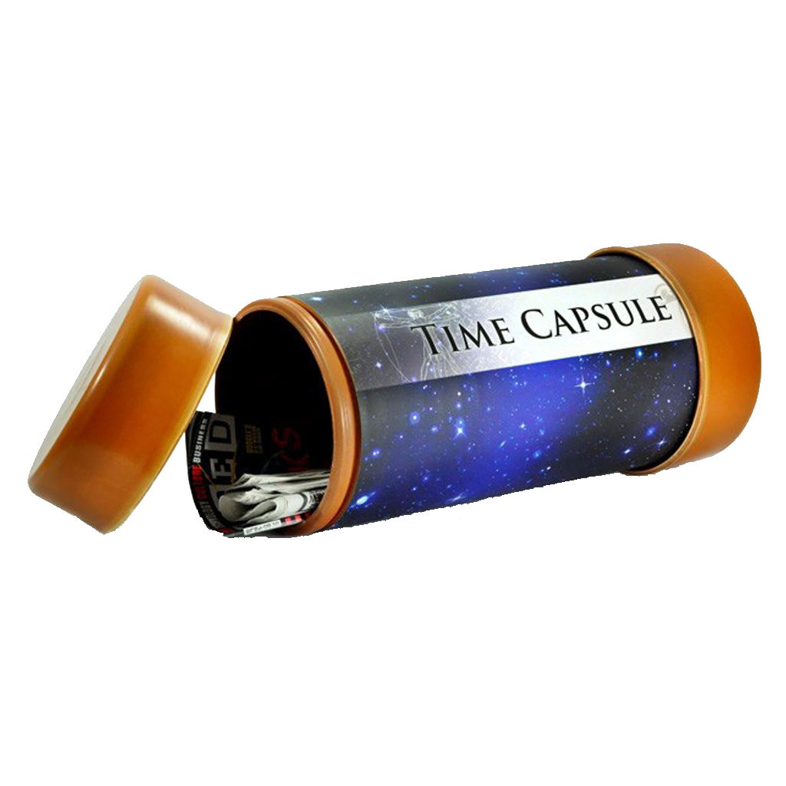

# Présentation du projet

	

Pour ce tutoriel vous allait développer une time capsule :
Le Principe ? S'écrire un message que l'on ne verra pas avant 1 an

# Consigne
Vous devez créer un contrat permettant de sauvegarder un message que vous avez écrit. Ce message ne dois pas être modifiable, ne dois pas pouvoir être récupéré avant 1 an, et ne peut être récupéré que par son propriétaire.

# Mettre en place l’environnement
Dans le cadre de cette formation nous allons utiliser un éditeur en ligne :
Rendez-vous sur https://remix.ethereum.org/

Le site contient un example d’un contrat ethereum. Vous pouvez le lire pour vous familiariser avec la syntaxe de Solidity.

Cliquez sur le "+" dans le coin supérieur gauche pour créer un nouveau fichier appelé Tutoriel.sol

> Si vous souhaitez continuer à developper en Solidity après ce tutoriel, je vous recommande d'installer http://truffleframework.com/