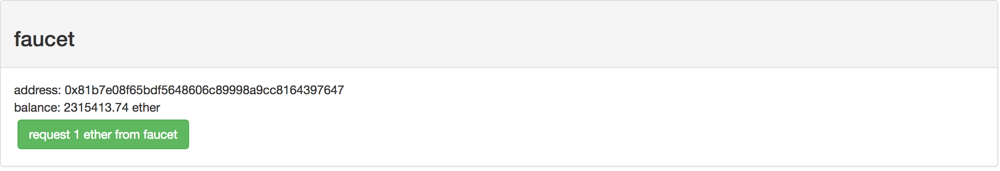

# Le Contrat
```javascript
pragma solidity ^0.4.24;

contract TimeCapsule {
	string message;
	address owner;
	uint createdTime;

	constructor(string _message) public {
		message = _message;
		createdTime = now;
		owner = msg.sender;
	}

	function getMessage() public view returns (string _message) {
		require(owner == msg.sender);
		if (now > creationTime + 365 days) {
            return message;
        } else {
            return "Vous ne pouvez pas lire le message avant 1 an !";
        }
    }
}
```
> Require ne permettant pour le moment pas de retourner de message d'erreur, dans le cas où c'est bien le propriétaire du contrat, j'ai décidé de renvoyer un message d'erreur au lieu de juste faire un require.

# Créer une adresse ethereum

Pour interagir avec la blockchain il vous faut une adresse ethereum.
Nous allons utiliser Metamask pour la créer, et pour interagir avec Ethereum depuis votre navigateur : https://chrome.google.com/webstore/detail/metamask/nkbihfbeogaeaoehlefnkodbefgpgknn

Après l'installation, cliquez sur l'icône de Metamask en haut à droite de votre navigateur, acceptez les conditions d'utilisations et définissez un mot de passe.
<p align="center">
	
</p>

Vous devez ensuite sauvegarder la phrase donnée par Metamask.


> ATTENTION : Cette phrase est le seul moyen de récupérer votre compte, il est impossible de la récupérer ! Vous devez également impérativement la garder PRIVÉE ! (celle ci-dessous est un compte vide ;-) )

<p align="center">
	
</p>


# Récupérer des tokens

Pour éviter de devoir dépenser de l'argent pour acheter des tokens, nous allons nous mettre sur un testnet Ethereum.
Pour cela cliquez en haut à gauche de Metamask et choisissez Ropsten test network.
<p align="center">
	
</p>

Cliquez ensuite sur buy
<p align="center">
	
</p>

Puis enfin ROPSTEN TEST FAUCET.
<p align="center">
	
</p>

Sur le site, cliquez sur "request 1 ether from faucet".
<p align="center">
	
</p>

Après quelques minutes, vous voilà désormais en possession d'un ether sur le testnet !


# Compilateur en ligne

[Rendez-vous sur ce lien](https://remix.ethereum.org/#version=soljson-v0.4.24+commit.e67f0147.js&optimize=false&gist=78dbcb3b6f0a8748c6efe8f10e7aff0e) pour voir le code de TimeCapsule dans le compilateur Solidity.

Cliquez ensuite à gauche sur Gist puis Tutoriel.sol.
<p align="center">
	
</p>


# Déploiement du contrat

Rendez-vous sur l'onglet RUN en haut à droite, cliquez sur ENVIRONNEMENT et choissisez Injected Web3.
Vous pouvez désormais remplir le champ message (situé à côté du bouton rouge deploy).
> ATTENTION: Il faut mettre votre message entre guillemets pour que cela fonctionne.
Cliquez sur Deploy, et sur submit sur la fenêtre Metamask qui s'affiche.
Une adresse s'affiche dans le terminal, c'est l'adresse de votre contrat sur le testnet Ethereum ! Félicitations !

<p align="center">
	
	
	
</p>

# Félicitations !

Félicitations ! Vous venez de déployer votre premier contrat sur Ethereum !

Nous allons maintenant interagir avec lui dans la prochaine partie.
